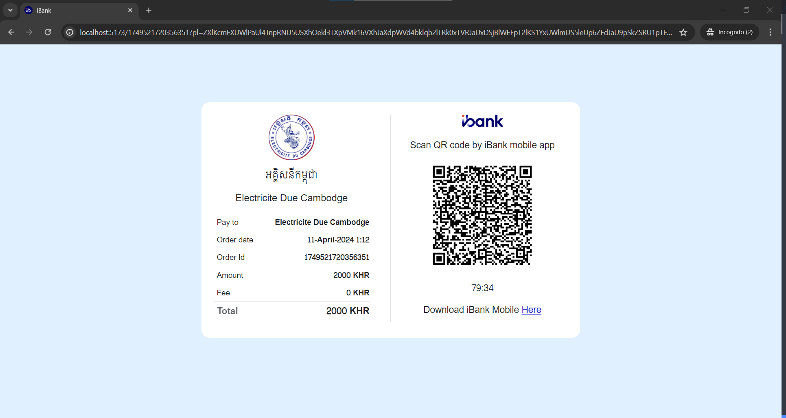
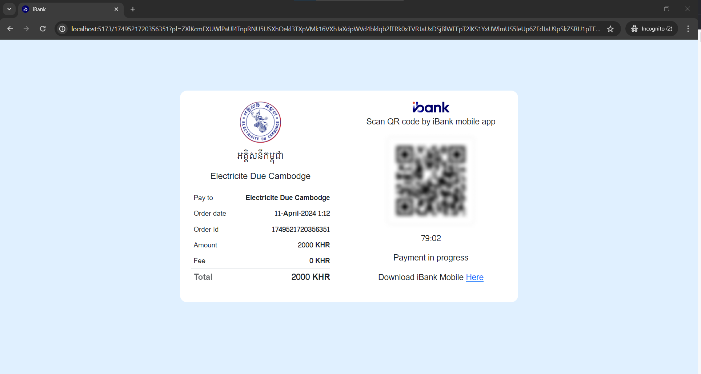
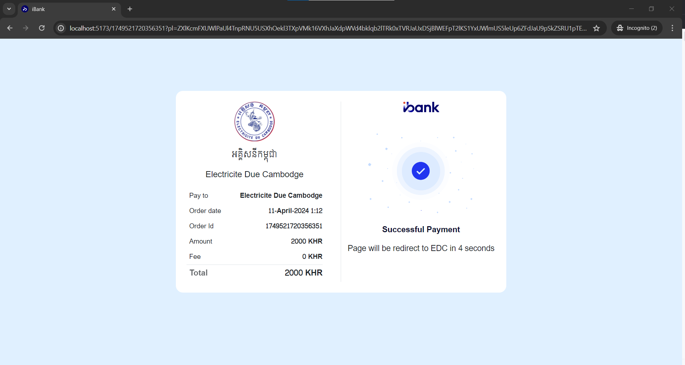
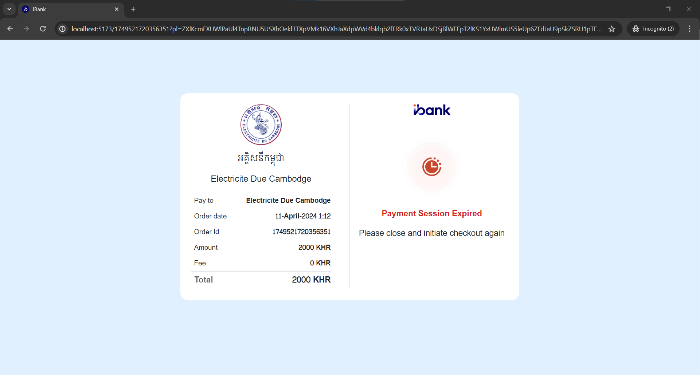
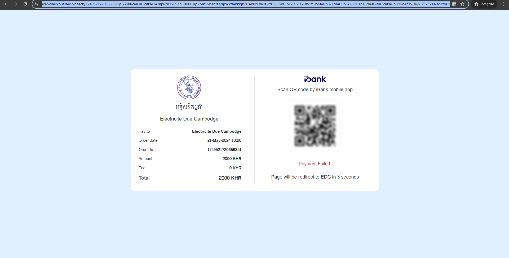
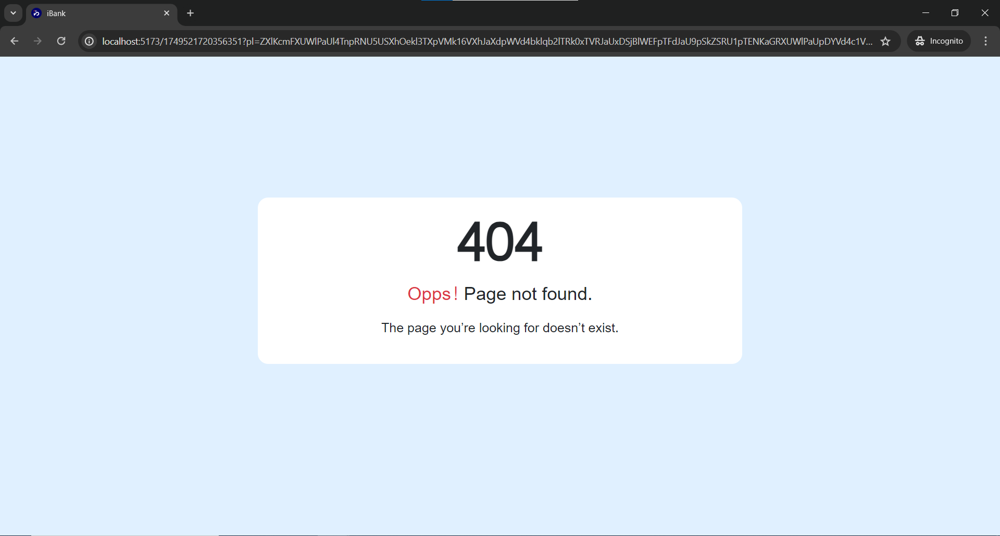
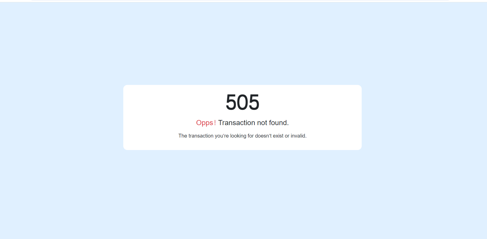

# EDC Checkout Website

Welcome to EDC Checkout Website !

## Description

This project provide the web page payment via EDC application. 

## Getting Started

Follow these instructions to get a copy of the project up and running on your local machine for development and testing purposes. 

### Prerequisites

The project need nodejs version 20.12.2 or compatibility version in your host server or local machine.

```bash
git clone https://gitlab.int.bic.tech/fintech/edc/edc-checkout-website.git
``` 


```bash
npm install
```

For local use :
```bash
npm run dev
```
For build :
```bash
npm run build
```
## Usage
This link will generate by EDC Payment Service and it will direct to edc web checkout website. 

1. #### Pending ####

####
2. #### In Progress

####
3. #### Success

####
4. #### Expired

####
5. #### Failed

####
6. #### Error or Token expired

###
7. #### Transaction Not Found

###

## Contributing
This project need rest api from EDC Payment Service.
### Endpoint usage :
1. #### Inquiry Data Payment
```
curl -X 'POST' \
  'http://localhost:8999/v1/internal/transaction/inquiry' \
  -H 'accept: application/json' \
  -H 'Content-Type: application/json' \
  -d '{
    "transactionId":"",
    "payload":""
}'
```

2. #### Inquiry QR content
```
curl -X 'POST' \
  'http://localhost:8999/v1/internal/transaction/generate-qr' \
  -H 'accept: application/json' \
  -H 'Content-Type: application/json' \
  -d '{
  "transactionId": "",
  "payload": ""
}'
```
## Acknowledgments
  #### For Developer
    You need to allow CORS from KESS Payment Service to use or testing !
  ####

  #### How to get web checkout. 
  ####
  => Request
  ```
        curl -X 'POST' \
        'https://edc-payment-service.dev.int.bic.tech/v1/edc-to-bank/transaction/create' \
        -H 'accept: application/json' \
        -H 'Content-Type: application/json' \
        -d '{
        "merchant_id": "EDC",
        "transaction_id": "1749521720356351",
        "transaction_amount": 2000.0,
        "transaction_currency": "KHR",
        "transaction_description": "",
        "bill_type": "utility",
        "return_url": "https://example.com/transaction/complete",
        "callback_url": "https://example.com/transaction/callback",
        "hash": "4be8fc1f50834aacb5c46005501cda8b",
        "details": [
            {
                "company_code": "EDC-BTB",
                "company_name": "អគ្គិសនីបាត់ដំបង",
                "consumer_code": "80581211",
                "consumer_name": "លោកជាសំណាង",
                "consumer_name_latin": "Mr. Chea Samnang",
                "amount": 1000.0
            },
            {
                "company_code": "EDC",
                "company_name": "អគ្គិសនីកម្ពុជា",
                "consumer_code": "90481599",
                "consumer_name": "លោកជាសំណាង",
                "consumer_name_latin": "Mr. Ly Seyha",
                "amount": 1000.0
            }
        ]
      }' 


```
=> Response Body 
```
{
  "code": "000",
  "message": "success",
  "data": {
    "webPaymentUrl": "https://edc-checkout.dev.bic.tech/1749521720356351?pl=ZXlKcmFXUWlPaUl4TnpRNU5USXhOekl3TXpVMk16VXhJaXdpWVd4bklqb2lTRk0xTVRJaUxDSjBlWEFpT2lKS1YxUWlmUS5leUp6ZFdJaU9pSkZSRU1pTENKaGRXUWlPaUpDYVd4c1VHRjViV1Z1ZENJc0ltbHpjeUk2SW1KcFkySmhibXNpTENKcWRHa2lPaUkwWW1VNFptTXhaalV3T0RNMFlXRmpZalZqTkRZd01EVTFNREZqWkdFNFlpSXNJbVJoZEdFaU9pSTBZbVU0Wm1NeFpqVXdPRE0wWVdGallqVmpORFl3TURVMU1ERmpaR0U0WWlJc0ltbGhkQ0k2TVRjeE5qSTJNVFl5Tml3aVpYaHdJam94T0RFMk1qWXhOakkxZlEuVG1jaTFHWk9Idk84ME5qcTVZM0IzUFU3Wmc4WWM0YmtURFZoNUhnZkJKdmhLMTBhSHc2dXgxRC1fNVdaRW1DMEJHVkc0LURRVXQyMmxXSHRaV09wNXc=",
    "mobileDeepLink": "com.bic.rdb/payment/edc/1749521720356351?pl=ZXlKcmFXUWlPaUl4TnpRNU5USXhOekl3TXpVMk16VXhJaXdpWVd4bklqb2lTRk0xTVRJaUxDSjBlWEFpT2lKS1YxUWlmUS5leUp6ZFdJaU9pSkZSRU1pTENKaGRXUWlPaUpDYVd4c1VHRjViV1Z1ZENJc0ltbHpjeUk2SW1KcFkySmhibXNpTENKcWRHa2lPaUkwWW1VNFptTXhaalV3T0RNMFlXRmpZalZqTkRZd01EVTFNREZqWkdFNFlpSXNJbVJoZEdFaU9pSTBZbVU0Wm1NeFpqVXdPRE0wWVdGallqVmpORFl3TURVMU1ERmpaR0U0WWlJc0ltbGhkQ0k2TVRjeE5qSTJNVFl5Tml3aVpYaHdJam94T0RFMk1qWXhOakkxZlEuVG1jaTFHWk9Idk84ME5qcTVZM0IzUFU3Wmc4WWM0YmtURFZoNUhnZkJKdmhLMTBhSHc2dXgxRC1fNVdaRW1DMEJHVkc0LURRVXQyMmxXSHRaV09wNXc="
  },
  "success": true,
  "message_kh": null
}